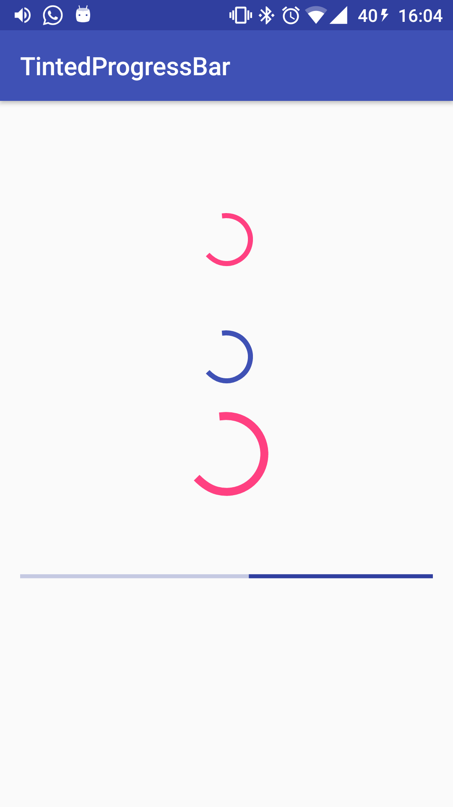

# Tinted ProgressBar

## What is a Tinted ProgressBar?

TintedProgressBar is a simple `ProgressBar` than can be tinted from the `xml`.

<div align="center">
  
</div>

## Usage
Simply add the View to your layout:
```xml
<com.rojoxpress.TintedProgressBar
        style="?android:attr/progressBarStyleLarge"
        android:layout_width="wrap_content"
        android:layout_height="wrap_content"
        android:layout_centerVertical="true"
        app:tint_color="@color/colorAccent"
        android:layout_centerHorizontal="true"
        android:id="@+id/progressBar" />
```